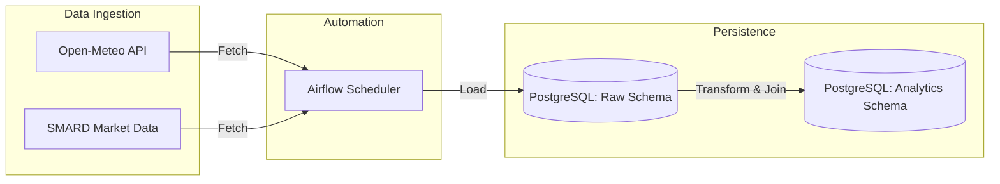
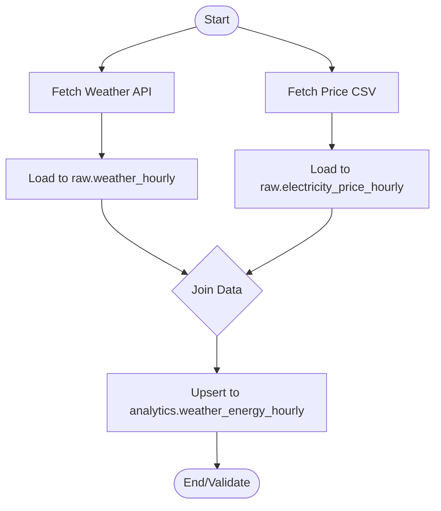

# Weather-Energy Analytics Pipeline

A robust, automated ETL (Extract, Transform, Load) system designed to integrate high-resolution meteorological data with German electricity market pricing for cross-domain analytics.

## Project Goal
The objective of this pipeline is to synthesize hourly weather observations and German electricity spot-market prices into a unified dataset. This enables stakeholders to conduct granular analysis, such as identifying correlations between temperature fluctuations and price volatility, specifically focused on the city of **Hamburg**.

## System Architecture

The system utilizes Apache Airflow for robust orchestration, ensuring reliable daily execution of the data pipeline.



## Data Pipeline Flow

The ETL process is broken into idempotent, task-oriented stages managed by the Airflow DAG `weather_energy_daily`.



## Technical Stack

- **Orchestration:** Apache Airflow 2
- **Language:** Python 3.12
- **Data Engineering:** pandas (transformation & normalization)
- **Database:** PostgreSQL 16
- **Containerization:** Docker & Docker Compose

## Core Configuration (Hamburg)

The pipeline is pre-configured to process data for Hamburg.

| Parameter | Value |
| :--- | :--- |
| **City** | Hamburg |
| **Latitude** | 53.5511 |
| **Longitude** | 9.9937 |
| **Timezone** | UTC |

## Deployment & Setup

This project uses Docker Compose for environment provisioning. Ensure Docker is installed on your host system.

### 1. Create configuration files

Create the local configuration files before starting any Compose service. The
PostgreSQL container requires `POSTGRES_PASSWORD` during its first startup.

```bash
cp .env.example .env
cp .env.city.example .env.city
```

Set a non-default `POSTGRES_PASSWORD` in `.env`. You can also set the city,
coordinates, and weather date range in `.env.city`; Compose passes these values
to every Airflow container.

### 2. Initialize Infrastructure

```bash
# Start PostgreSQL container
docker compose up -d postgres

# Initialize Airflow Environment
docker compose --profile airflow up airflow-init
docker compose --profile airflow up -d airflow-webserver airflow-scheduler
```

### Price-data coverage

`data/input/electricity_prices_sample.csv` is a complete **hourly** development
sample for 2025-01-01. Trigger the demo DAG for that UTC day, or replace/mount
`PRICES_CSV` with a complete hourly or 15-minute CSV that covers every requested
Airflow data interval. A static sample cannot provide market prices for future
scheduled runs.

---

*This project provides a reliable foundation for energy-market data analysis, supporting incremental data loading and ensuring high data integrity through strict validation rules.*
