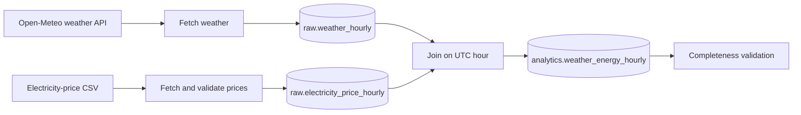

# Weather-Energy Analytics Pipeline

A local batch pipeline that joins hourly weather observations with German
electricity prices, stores raw and analytics data in PostgreSQL, and runs the
workflow through Apache Airflow.

This README is the complete local operating guide: it explains what the project
does, how the data moves, how to start it from a clean machine, how to run the
included Airflow demonstration safely, and how to diagnose common failures.

## What the pipeline does

For one configured city and market area, the pipeline:

1. Fetches hourly historical weather from Open-Meteo.
2. Reads hourly or 15-minute electricity-price data from a CSV file.
3. Validates timestamps, business keys, numeric measurements, and completeness.
4. Loads validated source records into PostgreSQL raw tables.
5. Joins weather and prices by UTC hour.
6. Upserts the joined rows into an analytics table.
7. Validates that the resulting analytics interval is complete and duplicate-free.

All timestamps are handled in UTC. This prevents daylight-saving-time ambiguity
when working with German electricity prices.



## Components

| Component | Responsibility |
|---|---|
| `src/weather_energy/clients/` | Fetches weather and cleans price input. |
| `src/weather_energy/transform/` | Joins valid weather and price rows. |
| `src/weather_energy/database/` | Creates schemas/tables and performs idempotent upserts. |
| `src/weather_energy/ingestion_tasks.py` | Testable Airflow task functions. |
| `dags/weather_energy_daily.py` | Airflow orchestration and task dependencies. |
| `docker-compose.yml` | PostgreSQL and Airflow local services. |
| `data/input/` | Input price CSV used by the pipeline. |

The PostgreSQL model is intentionally small:

| Table | Natural key | Contents |
|---|---|---|
| `raw.weather_hourly` | `timestamp_utc`, `city` | Source weather observations. |
| `raw.electricity_price_hourly` | `timestamp_utc`, `market_area` | Prepared hourly prices. |
| `analytics.weather_energy_hourly` | `timestamp_utc`, `city`, `market_area` | Joined analysis-ready data. |

Loads use PostgreSQL `ON CONFLICT` upserts. Re-running the same valid interval
updates existing records instead of creating duplicate business keys.

## Prerequisites

Install these before starting:

- Docker Engine/Desktop with Docker Compose v2 (`docker compose version`)
- Git
- Internet access for the first Airflow image/package download and weather API call
- Port `8080` available for Airflow and port `5442` available for PostgreSQL

Optional for local Python development and tests:

- Python 3.11 or 3.12
- `uv`

Check Docker first:

```bash
docker compose version
docker --version
```

## Quick start: run the included Airflow demonstration

The committed price fixture is a teaching sample. It covers exactly one Airflow
data interval:

```text
2025-01-01 02:00 UTC (inclusive) → 2025-01-02 02:00 UTC (exclusive)
```

Use the explicit manual trigger shown below. Do not expect this static file to
support today’s scheduled run or future daily runs.

### Step 1: clone and enter the project

```bash
git clone <your-repository-url>
cd weather-energy-data-pipeline
```

If you already have the repository, update it first:

```bash
git pull origin main
```

### Step 2: create local configuration

Never commit `.env` or `.env.city`.

```bash
test -f .env || cp .env.example .env
test -f .env.city || cp .env.city.example .env.city
```

Edit `.env` and change at least the password:

```dotenv
POSTGRES_PASSWORD=choose-a-strong-local-password
```

Passwords may include characters such as `@`, `:`, and `/`; Compose builds the
Airflow connection URL safely inside the container. Keep the remaining database
values aligned unless you intentionally change the local database name or user.

Edit `.env.city` for the city that should be stored with weather data:

```dotenv
CITY_NAME=Hamburg
CITY_LATITUDE=53.5511
CITY_LONGITUDE=9.9937
WEATHER_START_DATE=2025-01-01
WEATHER_DAYS=1
```

The Airflow containers load `.env.city`, so configured city values are used by
both the scheduler and task processes.

### Step 3: validate Compose configuration

```bash
docker compose config --quiet
```

No output means the Compose file and required variables are valid. If Compose
reports a missing `POSTGRES_PASSWORD`, return to Step 2.

### Step 4: start PostgreSQL

```bash
docker compose up -d postgres
docker compose ps
```

Wait until PostgreSQL is `healthy`.

### Step 5: initialize Airflow

```bash
docker compose --profile airflow up airflow-init
```

The first run downloads required Python packages and can take a few minutes.
Success is indicated by:

```text
airflow-init exited with code 0
```

If you changed `requirements-airflow.txt`, recreate and rerun this disposable
container before starting Airflow services:

```bash
docker compose --profile airflow rm -f airflow-init
docker compose --profile airflow up airflow-init
```

### Step 6: start Airflow services

Start the webserver and scheduler:

```bash
docker compose --profile airflow up -d airflow-webserver airflow-scheduler
docker compose --profile airflow ps
```

Wait until the webserver becomes healthy, then open:

```text
http://localhost:8080
```

Default local login credentials are:

```text
username: admin
password: admin
```

Change these through the Compose environment for any non-local deployment.

### Step 7: prevent an unwanted current-date sample run

The DAG is scheduled daily at 02:00 UTC. The sample CSV is historical, so pause
the DAG before allowing a current scheduled interval to execute:

```bash
docker compose exec airflow-scheduler airflow dags pause weather_energy_daily
```

For a new local setup, remove any automatically created DAG-run records before
starting the demo. This deletes Airflow metadata for this DAG only; it does not
delete PostgreSQL raw or analytics tables:

```bash
docker compose exec airflow-scheduler airflow dags delete --yes weather_energy_daily
```

### Step 8: trigger the demonstration interval

Airflow 2.10 uses `--exec-date` for a manual logical date:

```bash
docker compose exec airflow-scheduler airflow dags trigger --exec-date "2025-01-02T02:00:00+00:00" weather_energy_daily
```

The resulting interval is 2025-01-01 02:00 UTC through 2025-01-02 02:00 UTC,
which matches the committed CSV fixture.

In the Airflow UI, open `weather_energy_daily`, select the newest run, then use
Graph view. Successful execution follows this order:

```text
initialize_database_schema
fetch_weather + fetch_prices
load_weather_raw + load_prices_raw
build_analytics
validate_analytics
```

`fetch_weather` and `fetch_prices` run in parallel. The schema task gates both
database-loading tasks, so a fresh external PostgreSQL database is initialized
before raw data is written.

### Step 9: verify the result in PostgreSQL

```bash
docker compose exec postgres sh -c 'psql -U "$POSTGRES_USER" -d "$POSTGRES_DB" -c "SELECT COUNT(*) FROM analytics.weather_energy_hourly;"'
```

To inspect recent joined rows:

```bash
docker compose exec postgres sh -c 'psql -U "$POSTGRES_USER" -d "$POSTGRES_DB" -c "SELECT * FROM analytics.weather_energy_hourly ORDER BY timestamp_utc DESC LIMIT 10;"'
```

## Local Airflow walkthrough screenshots

The screenshots below are stored in `data/screenshots/` and tracked with the
repository so they are visible both locally and on GitHub.


## Running with real daily price data

For a real scheduled workflow, replace
`data/input/electricity_prices_sample.csv` with a CSV covering every requested
daily interval. The current container configuration reads that path.

Accepted input columns are normalized by the price client. The final prepared
schema is:

```csv
timestamp_utc,market_area,electricity_price_eur_mwh
2026-09-13T02:00:00Z,DE-LU,85.20
2026-09-13T03:00:00Z,DE-LU,83.10
```

Requirements:

- Use `DE-LU` (or set a matching `MARKET_AREA`) for the German market area.
- Provide all 24 hourly rows, or all 96 quarter-hour rows, for each interval.
- Use parseable UTC timestamps or timestamps with explicit offsets.
- Do not leave gaps or duplicate business keys.
- Provide a price interval that fully covers the Airflow processing interval.

The price task deliberately fails on missing or misaligned data. This protects
the analytics table from silently incomplete joins.

After replacing the input with continuously refreshed price data, unpause the
DAG to enable daily scheduling:

```bash
docker compose exec airflow-scheduler airflow dags unpause weather_energy_daily
```

## Local Python workflow

To run checks outside Docker:

```bash
uv sync --extra dev
./.venv/bin/python -m pytest
./.venv/bin/python -m ruff check .
```

The project test suite covers input validation, DST handling, CSV preparation,
database upserts, Airflow task boundaries, DAG structure, and Compose safety
configuration.

For the non-Airflow pipeline runner, install database dependencies and ensure
PostgreSQL is running:

```bash
uv sync --extra database --extra dev
./.venv/bin/python -m weather_energy.run_pipeline
```

The manual runner uses the weather date range from `.env.city`; its price input
must cover the same UTC hours for a complete analytics result.

## Monitoring and troubleshooting

View service status:

```bash
docker compose --profile airflow ps
```

Follow scheduler logs:

```bash
docker compose logs -f airflow-scheduler
```

List DAG import errors:

```bash
docker compose exec airflow-scheduler airflow dags list-import-errors
```

Common issues:

| Symptom | Cause and resolution |
|---|---|
| `database ... does not exist` during init | Pull the latest `main`; the Compose configuration now emits a database URL with no trailing newline. Recreate `airflow-init` and run Step 5 again. |
| `incomplete or misaligned 15-minute price data` | The CSV does not cover the requested interval. Add every hourly/quarter-hour timestamp exactly once. |
| Demo run stays queued | A current scheduled run may occupy the DAG’s one active-run slot. Pause the DAG and delete test DAG runs as shown in Step 7, then trigger the demo again. |
| Webserver is `health: starting` | Wait 30–60 seconds, then run `docker compose --profile airflow ps` again. |
| Port already allocated | Stop the conflicting service or change `POSTGRES_PORT`/`AIRFLOW_WEBSERVER_PORT` in `.env`. |
| Airflow initialization fails after dependency changes | Remove and recreate `airflow-init`, then repeat Step 5. |

## Reset or stop local services

Stop containers but preserve database data:

```bash
docker compose --profile airflow down
```

Remove containers **and** the PostgreSQL data volume for a fully fresh local
setup:

```bash
docker compose --profile airflow down -v --remove-orphans
```

The second command permanently removes local database data. Run the quick-start
steps again afterward.

## Security and repository hygiene

- `.env`, `.env.city`, generated output, and local docs are ignored by Git.
- The walkthrough screenshots are intentionally tracked so the README renders
  correctly on GitHub.
- Do not commit passwords, production database URLs, API keys, or downloaded
  market data unless explicitly intended and licensed for distribution.
- The Compose setup is for local development. The runtime package-install
  mechanism is convenient for learning but a production deployment should use a
  custom, pinned Airflow image.

## Future development roadmap

The current project is a reliable local foundation. The next goal is to evolve
it into a usable weather-and-energy analytics product while keeping the same
principles: source traceability, complete time-series data, explicit quality
checks, and simple operation for non-technical users.

The items below are planned improvements, not features currently delivered by
this repository.

### 1. Collect complete historical and daily data

Replace the teaching CSV with a documented, automated price-data source and
retain the original files used by each pipeline run. Historical collection
should backfill enough data to support seasonal and year-over-year analysis;
daily collection should keep the dataset current.

**Example workflow**

```text
Every day at 03:00 UTC
  → download the completed DE-LU day-ahead price file
  → store the untouched source file with source date and checksum
  → validate 24 hourly or 96 quarter-hour records
  → upsert raw prices and build analytics rows
  → record source, row count, freshness, and load status
```

Suggested additions:

- A `raw.source_files` table with filename, URL, checksum, retrieval time, and
  processing status.
- Partitioned price and weather tables for efficient multi-year storage.
- A source registry describing market area, provider, licence, frequency, and
  expected timezone.
- Backfill commands that can safely process a selected date range, such as
  `2023-01-01` through `2025-12-31`.
- Data-freshness alerts when yesterday’s expected price or weather data is not
  available.

**Example quality rule:** a DE-LU hourly day is accepted only when it has 24
unique UTC timestamps; a quarter-hour day is accepted only when it has 96.
Daylight-saving transitions need their own expected-count rule and explicit
timezone handling.

### 2. Build a global city and location catalogue

Move from one city in `.env.city` to a maintained location catalogue. Users
should select a city by name, country, or coordinates, while the pipeline uses
a stable internal identifier and stores the exact source coordinates.

**Example city record**

| Field | Example |
|---|---|
| `city_id` | `berlin-de` |
| `city_name` | Berlin |
| `country_code` | DE |
| `latitude` / `longitude` | `52.5200` / `13.4050` |
| `timezone` | `Europe/Berlin` |
| `market_area` | `DE-LU` |

Suggested capabilities:

- Searchable cities worldwide using a trusted geographic dataset.
- Validation that disambiguates names such as “Springfield” by country and
  coordinates.
- City-to-market-area mapping, because electricity prices generally apply to a
  market region rather than an individual city.
- Multiple selected cities in one run, with per-city weather rows and shared
  regional price rows.

**Example user action:** choose “Toronto, Canada” in the app; the application
stores its coordinates and timezone, selects the configured Ontario market data
source, then starts collecting weather and price data for that location.

### 3. Add trends, statistics, and interpretable cost analysis

Create documented metrics that help users understand price behavior without
overstating causality. Weather variables can be associated with prices, but a
correlation alone does not prove that weather caused a price change.

**Example dashboard metrics**

| Question | Example calculation |
|---|---|
| How expensive was this week? | Mean, median, minimum, and maximum EUR/MWh by week. |
| When are prices usually highest? | Average price by UTC hour and weekday. |
| Does cold weather coincide with higher prices? | Compare temperature bands with median price and display correlation plus sample size. |
| How volatile is the market? | Rolling 7-day standard deviation and day-to-day percentage change. |
| What would wholesale energy cost? | `consumption_mwh × electricity_price_eur_mwh`. |

**Payment interpretation example:** if a household uses `0.35 MWh` in a period
whose average wholesale price is `90 EUR/MWh`, the wholesale-energy component is
`31.50 EUR`. This is not a final consumer bill: network charges, taxes, levies,
supplier margin, fixed fees, and the customer’s tariff must be shown separately
or clearly marked as unavailable.

Recommended analytical outputs:

- Daily, weekly, monthly, seasonal, and year-over-year comparisons.
- Temperature, wind, humidity, and cloud-cover bands with confidence intervals.
- Peak-price events with the surrounding weather and market context.
- Downloadable CSV and chart data, including metric definitions and date range.
- A methodology page that labels observed relationships as descriptive rather
  than causal unless a suitable causal study is performed.

### 4. Deliver a simple one-click application

Add a small web application—Streamlit is a practical first choice—that reads
from the analytics database and hides infrastructure complexity behind a clear
interface. The first experience should work after cloning the repository and
starting one documented command.

**Target user journey**

```text
Clone repository
  → copy configuration templates
  → run one start command
  → open a browser
  → choose a city, date range, and market area
  → view trends, statistics, and cost explanations
```

**Example one-command local start**

```bash
docker compose --profile app up --build
```

That future Compose profile could start PostgreSQL, the Airflow scheduler, and
an application at `http://localhost:8501`. A GitHub Release should also provide
a versioned source archive and clear platform-specific instructions.

Suggested app screens:

| Screen | Example interaction |
|---|---|
| Overview | Select Berlin and the last 30 days; see price, temperature, and data-freshness cards. |
| Trends | Compare weekday/hour heatmaps for price and temperature. |
| Cost estimator | Enter `250 kWh`; see the estimated wholesale component and a clear list of excluded bill items. |
| City comparison | Compare Hamburg, Berlin, and Munich over the same date range. |
| Data quality | See source timestamp, loaded row count, missing intervals, and last successful pipeline run. |

The application should be read-only by default. Administrative actions such as
adding a data source, running backfills, or changing credentials should require
separate authenticated controls.

### 5. Strengthen reliability, governance, and deployment

As the project moves beyond local learning, replace runtime package installation
with a custom version-pinned Docker image and add repeatable automation.

**Example production-ready delivery path**

1. Build an immutable application image in CI.
2. Run unit, integration, and data-quality tests on every pull request.
3. Publish the image only after tests and security scans pass.
4. Deploy configuration and secrets through the target platform’s secret store.
5. Monitor task failures, source freshness, database growth, and API limits.

Additional safeguards:

- Role-based access for app users and administrators.
- Encrypted backups and a tested restore procedure.
- Retention policies for raw files and analytics tables.
- Source licences and attribution recorded alongside downloaded data.
- Alerting for failed DAG runs, stale data, and unusual price values.

### Proposed delivery milestones

| Milestone | Deliverable | Demonstration of completion |
|---|---|---|
| M1 — Complete data | Automated historical backfill and daily price ingestion. | A year of validated data is loaded reproducibly from documented sources. |
| M2 — Multi-city | Global city catalogue and market mapping. | A user can select three cities and receive separate weather series with the correct market data. |
| M3 — Analytics | Trend, volatility, and transparent cost metrics. | A dashboard shows weekly trends and explains each calculation with an example. |
| M4 — App | One-command local web application. | A new user clones the repo, runs the documented command, and uses the app in a browser. |
| M5 — Operations | CI, backups, observability, and release process. | A failed source load produces an alert and a documented recovery path. |

This roadmap keeps the project focused: first obtain trustworthy, complete data;
then make insights understandable; finally make the experience accessible to
anyone who can clone the repository and start the application.

## License

See [LICENSE](LICENSE).
