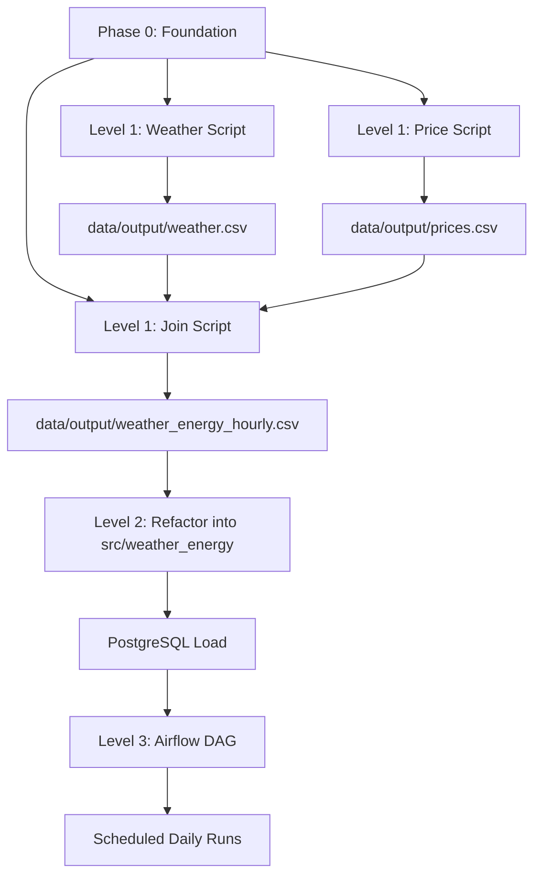
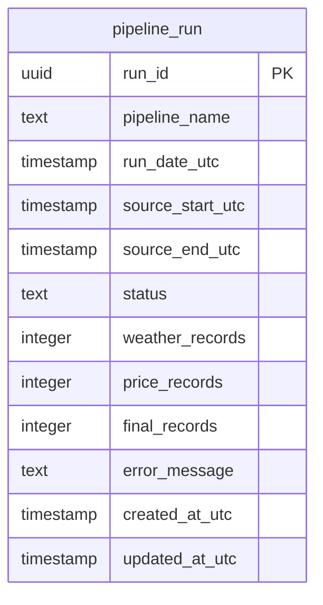
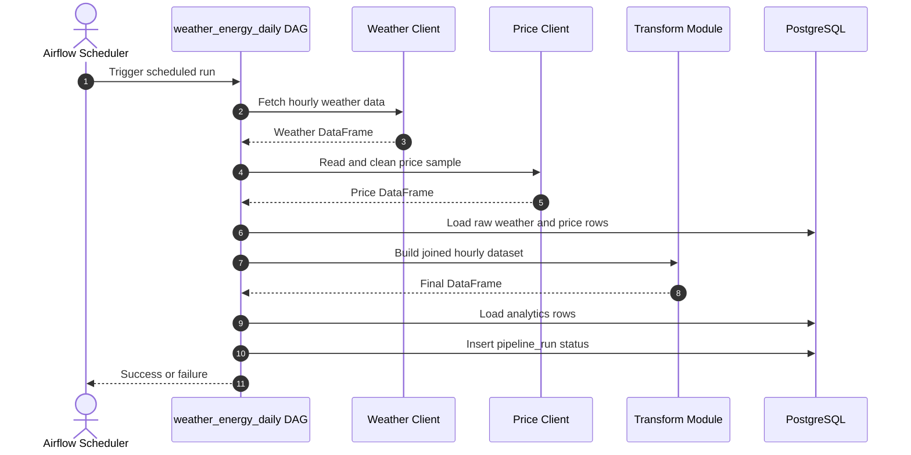

# Project Clue

This document is the working map for the repository `weather-energy-data-pipeline`.
Its goal is to make the project clear enough that three junior developers can work in parallel,
finish tasks independently, and create issues directly from this plan.

## Project Goal

Build a small batch pipeline that:

1. Downloads hourly weather data for a chosen city from Open-Meteo.
2. Reads a small electricity price sample from `data/input/`.
3. Cleans both datasets into a shared UTC hourly format.
4. Joins the datasets into one final hourly analytics file.
5. Later, loads the same data into PostgreSQL.
6. Later, runs the pipeline through Airflow on a daily schedule.

## Core Project Rules

- Keep all timestamps in UTC.
- Keep the first version simple and local before adding infrastructure.
- Do not put secrets, tokens, passwords, or large raw downloads into Git.
- Prefer small scripts and small reusable functions over one large script.
- Every task should be completable by one developer without waiting for another developer to finish a prerequisite task.
- Each task should have at most 4 subtasks.
- Use clear file ownership so developers can work in parallel.

## Suggested Team Model

The project is split into three developer workstreams.

### Developer 1 - Weather Ingestion Owner

Responsible for:

- Weather API requests
- Weather CSV generation
- Weather client module later in Level 2
- Weather-related tests later in Level 2

Independent deliverables:

- `scripts/get_weather.py`
- `src/weather_energy/clients/weather_client.py`
- `tests/test_weather_client.py`

### Developer 2 - Electricity Price Owner

Responsible for:

- Preparing the electricity sample CSV
- Cleaning and aggregating price data
- Price client module later in Level 2
- Price-related validation later in Level 2

Independent deliverables:

- `data/input/electricity_prices_sample.csv`
- `scripts/prepare_prices.py`
- `src/weather_energy/clients/price_client.py`

### Developer 3 - Join, Database, and Orchestration Owner

Responsible for:

- Joining weather and price data
- Building the final dataset
- Database loading later in Level 2
- Pipeline orchestration later in Level 2 and Level 3
- Repository setup and project coordination

Independent deliverables:

- `scripts/build_dataset.py`
- `src/weather_energy/transform/weather_energy.py`
- `src/weather_energy/database/loader.py`
- `src/weather_energy/run_pipeline.py`
- `dags/weather_energy_daily.py`

## Phase Map

The project is divided into Phase 0, Level 1, Level 2, and Level 3.

### Phase 0 - Project Foundation

Goal: prepare the repository so the team can work without confusion.

Deliverables:

- repository structure
- dependency definition
- Git hygiene files
- developer guidance files
- local IDE setup

Subtasks:

1. Confirm repo structure and target folders.
2. Add `pyproject.toml` and dependency groups.
3. Add `.gitignore`, `.env.example`, and VS Code settings.
4. Create placeholder package and script files with docstrings only.

Independent ownership:

- Developer 3 owns the coordination and structure.
- Developer 1 reviews weather naming and file layout.
- Developer 2 reviews data/input conventions and sample file naming.

### Level 1 - Basic Local Pipeline

Goal: produce a final joined CSV from two local sources.

Deliverables:

- weather script
- price preparation script
- join script
- sample price input
- final output CSV

Task 1: Weather download

Subtasks:

1. Call Open-Meteo for hourly weather data.
2. Accept coordinates and date range as input.
3. Write `data/output/weather.csv`.
4. Document the weather output columns.

Task 2: Price preparation

Subtasks:

1. Read the sample price CSV from `data/input/`.
2. Normalize timestamps to UTC.
3. Aggregate quarter-hourly values to hourly values when needed.
4. Write `data/output/prices.csv`.

Task 3: Final dataset build

Subtasks:

1. Read weather and price outputs.
2. Join both datasets on `timestamp_utc`.
3. Remove missing or invalid required values.
4. Write `data/output/weather_energy_hourly.csv`.

Task 4: Level 1 verification

Subtasks:

1. Check required columns in each output.
2. Confirm the final dataset has no duplicate timestamps.
3. Confirm the files run from the command line.
4. Record the sample source and assumptions in docs.

Independent ownership:

- Developer 1 owns Task 1.
- Developer 2 owns Task 2.
- Developer 3 owns Task 3 and Task 4 verification.

### Level 2 - Reusable Code, Tests, and PostgreSQL

Goal: move the logic into reusable modules and load data into PostgreSQL safely.

Deliverables:

- reusable Python modules under `src/weather_energy/`
- PostgreSQL schema
- database loader
- validation
- tests
- one pipeline entry point

Task 1: Weather module refactor

Subtasks:

1. Move weather fetching logic into `src/weather_energy/clients/weather_client.py`.
2. Return a pandas DataFrame instead of writing files directly.
3. Add validation for required weather fields.
4. Keep the Level 1 script as a thin wrapper.

Task 2: Price module refactor

Subtasks:

1. Move price reading and cleaning logic into `src/weather_energy/clients/price_client.py`.
2. Return a pandas DataFrame.
3. Validate timestamp and price columns.
4. Keep the Level 1 script as a thin wrapper.

Task 3: Transformation and loading

Subtasks:

1. Build the join logic in `src/weather_energy/transform/weather_energy.py`.
2. Add database loading helpers in `src/weather_energy/database/loader.py`.
3. Create a single pipeline runner in `src/weather_energy/run_pipeline.py`.
4. Make loads idempotent with business keys.

Task 4: Testing and database setup

Subtasks:

1. Create PostgreSQL tables in `sql/create_tables.sql`.
2. Add at least two tests for joins and validation.
3. Add `docker-compose.yml` for PostgreSQL.
4. Confirm reruns do not create duplicates.

Independent ownership:

- Developer 1 owns Task 1 and weather tests.
- Developer 2 owns Task 2 and price validation.
- Developer 3 owns Task 3 and Task 4.

### Level 3 - Airflow Orchestration

Goal: schedule the tested pipeline daily in Airflow.

Deliverables:

- Airflow DAG
- Airflow-ready Docker Compose setup
- logged daily workflow
- manual trigger support

Task 1: Airflow structure

Subtasks:

1. Add the Airflow service configuration.
2. Mount `dags/`, `src/`, and `sql/` into the Airflow containers.
3. Ensure the Airflow containers can import project modules.
4. Keep Airflow separate from business logic.

Task 2: DAG implementation

Subtasks:

1. Create `dags/weather_energy_daily.py`.
2. Define the daily schedule and retries.
3. Call reusable Python functions from `src/weather_energy/`.
4. Keep the DAG thin and readable.

Task 3: Operational checks

Subtasks:

1. Confirm the DAG appears in the UI.
2. Trigger a manual run.
3. Review logs for counts and date ranges.
4. Fix import or runtime failures.

Task 4: Documentation and handoff

Subtasks:

1. Record Airflow run assumptions.
2. Note the timezone used for scheduling.
3. Add a screenshot after a successful run.
4. Update the README with the final workflow summary.

Independent ownership:

- Developer 1 owns weather retry behavior and API failure handling.
- Developer 2 owns price task robustness and input validation.
- Developer 3 owns DAG creation, orchestration, and deployment checks.

## Phase 0 Task Breakdown for Issues

Use this section as the source for GitHub issues.

### Phase 0.1 - Repository Setup

Subtasks:

1. Confirm folder structure against the project guide.
2. Create the Python package skeleton under `src/weather_energy/`.
3. Create the Level 1 script skeletons under `scripts/`.
4. Add placeholder test files and sample input files.

### Phase 0.2 - Dependency and Environment Setup

Subtasks:

1. Add `pyproject.toml`.
2. Add `.env.example`.
3. Add `.gitignore`.
4. Add `.vscode/settings.json` and `.vscode/launch.json`.

### Phase 0.3 - Documentation Baseline

Subtasks:

1. Keep `README.md` aligned with the setup guide.
2. Create `docs/clue.md`.
3. Create `docs/data-sources.md`.
4. Create `docs/decisions.md` and `docs/team-agreement.md`.

### Phase 0.4 - Sample Data Baseline

Subtasks:

1. Add the minimal electricity price sample.
2. Define the expected sample schema.
3. Record source and time zone assumptions.
4. Keep generated output out of Git.

## Workflow Design

The workflow should let each developer progress independently.

### Independence Rules

- Developer 1 does not need the database or Airflow to finish weather ingestion.
- Developer 2 does not need the weather API to finish price preparation.
- Developer 3 can build the join and orchestration logic using agreed file contracts.
- Shared contracts must be documented before implementation starts.

### File Contract Strategy

Use file contracts to reduce dependencies between developers.

1. Define the output schema before coding.
2. Treat script outputs as contracts between teams.
3. Keep the input/output column names stable.
4. When a module changes, update the contract in docs first.

### Recommended Handoff Order

1. Agree on the schemas for `weather.csv` and `prices.csv`.
2. Developer 1 implements weather output.
3. Developer 2 implements price output.
4. Developer 3 implements the join and final dataset.
5. Developer 3 later coordinates database and Airflow integration.

## Workflow Flowchart

## ERD

The project needs one pipeline run table to track executions, inputs, outputs, and status.

### Table: `pipeline_run`

Purpose:

- store every execution of the batch pipeline
- record which source files or date range were processed
- track success, failure, and timestamps

Suggested columns:

| Column | Type | Notes |
|---|---|---|
| `run_id` | UUID or bigserial | Primary key |
| `pipeline_name` | text | Example: `weather_energy_daily` |
| `run_date_utc` | timestamp | When the run was started |
| `source_start_utc` | timestamp | Earliest input timestamp processed |
| `source_end_utc` | timestamp | Latest input timestamp processed |
| `status` | text | Example: `started`, `success`, `failed` |
| `weather_records` | integer | Weather rows handled |
| `price_records` | integer | Price rows handled |
| `final_records` | integer | Final joined rows |
| `error_message` | text | Null on success |
| `created_at_utc` | timestamp | Audit timestamp |
| `updated_at_utc` | timestamp | Audit timestamp |

### ERD Diagram

## Sequence Diagram

This sequence shows the intended end-to-end daily pipeline.

## Phase-by-Phase Project Plan

### Phase 0 Deliverables

- project skeleton exists
- team knows folder ownership
- dependency file is committed
- configuration files are committed
- sample input placeholder is present

### Level 1 Deliverables

- weather CSV can be produced
- price CSV can be prepared
- joined final CSV can be produced
- developer responsibilities are independent
- file formats are documented

### Level 2 Deliverables

- reusable code exists in `src/`
- tests cover the key logic
- PostgreSQL can accept loaded data
- the pipeline can run twice safely
- logging and validation are in place

### Level 3 Deliverables

- Airflow runs the pipeline daily
- the DAG is visible in the UI
- manual runs are successful
- retries are enabled
- logs are useful and safe

## Issue Planning Template

Use the following structure when converting this document into issues.

### Issue Title Format

- `P0.1 Repository structure`
- `L1.1 Weather download script`
- `L1.2 Price preparation script`
- `L1.3 Final dataset build`
- `L2.1 Weather module refactor`
- `L2.2 Price module refactor`
- `L2.3 Transformation and loading`
- `L3.1 Airflow structure`
- `L3.2 DAG implementation`

### Issue Description Format

Each issue should contain:

1. Goal
2. Why it matters
3. Inputs
4. Outputs
5. Up to 4 subtasks
6. Acceptance criteria

## Acceptance Criteria for the Whole Project

- The repository structure matches the agreed plan.
- The three Level 1 scripts produce the final joined CSV.
- The Level 2 modules are reusable and tested.
- PostgreSQL loading is idempotent.
- Airflow runs the pipeline daily.
- The whole project can be explained by reading this file and the README.

